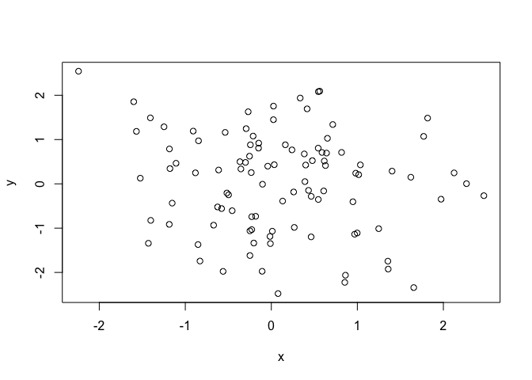

cm004
================

This is a line of text

-bullet 1 -bullet 2

``` r
x <- rnorm(100)
y <- rnorm(100)
plot(x,y)
```



``` r
summary(x)
```

    ##     Min.  1st Qu.   Median     Mean  3rd Qu.     Max. 
    ## -2.24114 -0.50197  0.01805  0.09168  0.61906  2.47077
